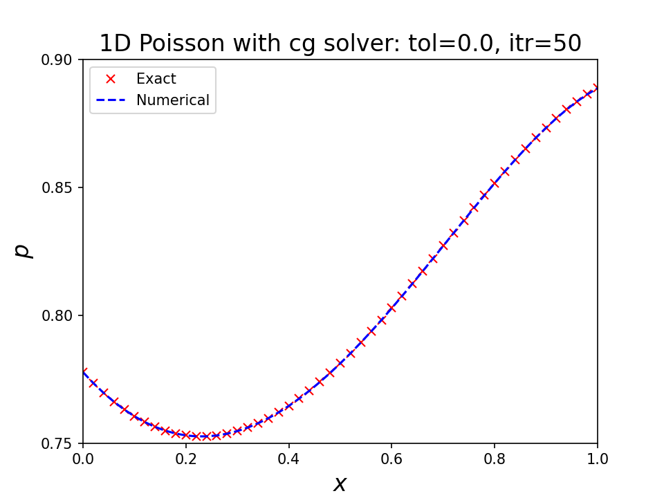
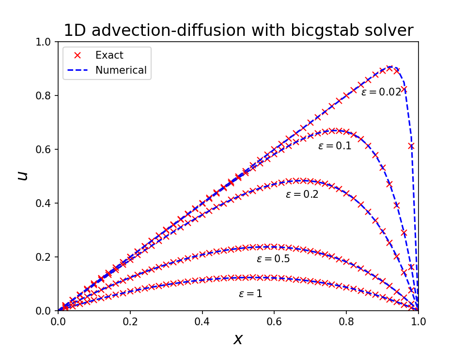

# THIS LIBRARY IS CURRENTLY WIP (LIMITED FEATURES ARE AVAILABLE)!! IT IS ALPHA STAGE

# pyapes

**PY**thon **A**wesome **P**artial differential **E**quation **S**olver (general purpose finite difference PDE solver)


## Description

`pyapes` is designed to solve various engineering problems in rectangular grid.

The goal of `pyapes` (should be/have) is

- Cross-platform
  - Both tested on Mac and Linux (Arch)
  - Windows support is under testing
- GPU acceleration in a structured grid with [PyTorch](https://pytorch.org)
  - Use of `torch.Tensor`. User can choose either `torch.device("cpu")` or `torch.device("cuda")`.
- Generically expressed (OpenFOAM-like, human-readable formulation)

## Installation

We recommend to use `poetry` to manage all dependencies.

```bash
git clone git@gitlab.ethz.ch:kchung/pyapes.git
cd pyapes
poetry install
```

> Later, `pip` install via pypi.org will be supported.

## Dependencies

- Core dependency
  - `python >= 3.10`
  - `numpy >= 1.21.0`
  - `torch >= 1.10.0`
  - `pyevtk >= 1.2.0`
  - `tensorboard >= 2.7.0`
- Misc dependency (Aesthetic)
  - `tqdm >= 4.62.3`
  - `rich >= 10.12.0`

## Implemented Features

- CPU/GPU computation using `torch`
- FDM Discretizations
  - Spatial: `Grad`, `Laplacian`, `Div`
    - Supports flux limiter `upwind` for the `Div` operator
  - Temporal: `Ddt`
- Boundary conditions:
  - Supports `Dirichlet`, `Neumann`, `Periodic`, and `Symmetry`
- Testing and demonstration
  - `Mesh`, `Field`, `FDM`
  - `Solver`
    - The Poisson equation
    - The advection-diffusion equation

## Examples

> For the clarity, below code snippets are vastly simplified. See `./demos/` folder for more details

### The 1D Poisson equation

Problem description:

The 1D Poisson equation is given

$$
\frac{d^2 p(x)}{dx^2} = f(x),~\text{where}~x\in[0, 1]
$$

with the right-hand-side,

$$
f(x) = 1 - 2 x^2,
$$

and the Dirichlet boundary condition,

$$
p(0) = \frac{7}{9},~p(1) = \frac{8}{9}.
$$

From the given equation, the corresponding exact solution is

$$
p(x) = \frac{7}{9} - \frac{2}{9}x + \frac{x^2}{2} - \frac{x^4}{6}.
$$

Numerical solution:

```python
# Only shows relevant modules
from pyapes.core.geometry import Box
from pyapes.core.mesh import Mesh
from pyapes.core.solver.fdm import FDM
from pyapes.core.solver.ops import Solver
from pyapes.core.variables import Field
...

# Construct mesh
mesh = Mesh(Box[0:1], None, [0.02])

# Construct scalar field to be solved
var = Field("p", 1, mesh, {"domain": f_bc, "obstacle": None})
# Set RHS of PDE
rhs = torch.Tensor(...)

# Set solver and FDM discretizer
solver = Solver({"fdm": {"method": "cg", "tol": 1e-6, "max_it": 1000, "report" True}})
fdm = FDM()

# ∇^2 p = r
solver.set_eq(fdm.laplacian(1.0, var) == fdm.rhs(rhs))
# Solve for var
solver.solve() # solver convergence can be checked by accessing member, `solver.report`
```

Results:



### The 1D steady-state advection-diffusion equation

Problem description:

The 1D Poisson equation is given

$$
\frac{du(x)}{dx} - \epsilon\frac{d^2 u(x)}{dx^2} = 1,~\text{where}~x\in[0, 1]
$$

with the Dirichlet boundary condition

$$
u(0) = u(1) = 0.
$$

From the given equation, the corresponding exact solution is

$$
u(x) = x - \frac{e^{- \frac{1-x}{\epsilon}} - e^{-\frac{1}{\epsilon}}}{1-e^{-\frac{1}{\epsilon}}}.
$$

Numerical solution:

```python
# Modules imported are similar to the previous example
...

# Construct mesh
mesh = Mesh(Box[0:1], None, [0.02])

# Construct scalar field to be solved
var = Field("u", 1, mesh, {"domain": f_bc, "obstacle": None})

# Set solver and FDM discretizer
solver = Solver({"fdm": {"method": "bicgstab", "tol": 1e-6, "max_it": 1000, "report" True}})
fdm = FDM()

# ∇u - 𝞮∇^2 u = 1
solver.set_eq(fdm.grad(var) - fdm.laplacian(epsilon, var) == 1.0)
# Solve for var
solver.solve() # solver convergence can be checked by accessing member, `solver.report`
```

Results:



## Todos

- Boundary conditions
  - [ ] Inflow/Outflow
- Need different derivative order at the cell face
  - Additional features
    - [ ] High order time discretization
    - [ ] Immersed body BC
    - [ ] Higher order flux limiters (`quick`)
- Testing and validation
  - [ ] `Ddt` class (implementation is tested but haven't validated with practical test cases)
  - [ ] Tests in higher dimension.
  - Create test files
    - `test_solver.py`
      - [ ] The Burgers' equation
      - [ ] The Navier-Stokes equation at low Reynolds numbers
      - [ ] The Black-Scholes equation
- Publish to pypi.org
